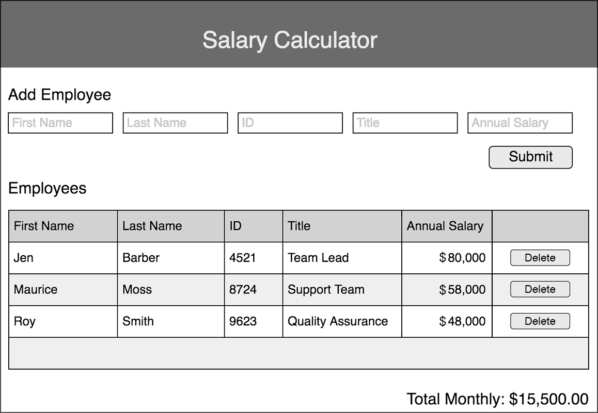

# Weekend Challenge: jQuery Salary Calculator

Create an application that records employee salaries and adds salaries up to report monthly costs.

## Topics Covered

- JavaScript
- jQuery - Selectors, append, and event handling

## Assignment

The application should have an input form that collects _employee first name, last name, ID number, job title, annual salary_.

A 'Submit' button should collect the form information, store the information to calculate monthly costs, append information to the DOM and clear the input fields. Using the stored information, calculate monthly costs and append this to the to DOM. If the total monthly cost exceeds $20,000, add a red background color to the total monthly cost.

<!--no button for it, but want it on the DOM,object.annualsalary, add up costs monthly costs,  -->

[]fix table
[]make table look like wirefram
[] wireframe has inputs at to[(name, id,$ etc)]

[] make inputs inline with list
[x] make input content, input content only
[]if no adding do not append monthly
[x]find monthly
[x]find group that is not being appended
[x]where is append?
[x]where is if statement saying if/ else
[x]add up salaries
[x] monthly costs
[x] total annual salary
[x]where is monthly going?
[x]get location of monthly and clear value
[x] where will this color go? -- total monthly cost
[x] get if x > 20k console.log
[x] if statement form//form made , not working
[x] where is total monthly cost? div
[x] what is color id????
[x]append css for redbackground
[x] find where we can place the empty
[x] getting so monthly clears and sums new total
[x]label total salary
[x] monthly income shows up even when nothing is entered via inputs
[x] what's stopping other stuff from being added?
[x]where are the data from inputs?
[x]append monthly
[] grab variable names and reorganize
[x] anSal / 12 = monthly costs
Create a delete button that removes an employee from the DOM. For Base mode, it does **not** need to remove that Employee's salary from the reported total.

### Files Provided

No files have been provided (just instructions.md and a readme.md). Instead of forking and cloning this repo, please choose "Use This Template" (green button) and name your new repo "jquery-salary-calculator" and clone down from there. Make sure to commit regularily!

### Wireframe

## Stretch Mode

Add styling or extra functionality that fits with the theme of this assignment.

Once the employee is deleted, update the total spend on salaries account for this employee's removal. This will require that the logic knows which element was removed. You will need to use `.text()` as a getter or look into jQuery's `.data()` function. This is tricky!

## Reminder About Modes

Above, we introduced the concept of levels of difficulty. "Mode" is how we will typically refer to each level. Below is a brief explanation of

- what to expect when attempting each mode
- if they are required or not

| Mode    | Description                                                                |
| ------- | -------------------------------------------------------------------------- |
| Base    | required                                                                   |
| Stretch | optional, stretches your understanding and may require additional research |

## Assignment Submission

Check in your repo, then turn in your work via the Prime Academy Assignment Application at [http://primeacademy.io](http://primeacademy.io), as usual and don't hesitate to hit up the Slack channel as needed!
